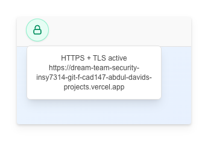

# Dream Team Security - INSY7314 Payment Processing System

A secure payment processing system built with Next.js, demonstrating industry-standard security practices including HTTPS/TLS encryption, input validation, authentication, and protection against common web vulnerabilities.

## Live Demo

🔗 **Deployed on Vercel:** [https://dream-team-security-insy7314.vercel.app](https://dream-team-security-insy7314.vercel.app)

## Team Members

| Name | Student Number |
| ---- | -------------- |
| Joshua Wood | ST10296167 |
| Abdul Davids | ST10267411 |
| Nicholas Phillips | ST10263496 |

## Project Overview

This application is a secure payment processing platform that allows employees to submit payment requests and administrators to verify and approve them. The system prioritizes security at every layer, implementing multiple defense mechanisms to protect sensitive financial data and prevent common attack vectors.

### Key Features

- Employee payment submission with validation
- Admin payment verification workflow
- Secure authentication with JWT tokens
- Real-time HTTPS/TLS status indicators
- Input sanitization and validation
- Session management
- CSRF protection
- Security headers implementation

## Getting Started

### Prerequisites

- Node.js 18+
- npm or yarn
- MongoDB Atlas account (or local MongoDB instance)

### Installation

1. Clone the repository:
```bash
git clone https://github.com/AbdulDavids/dream-team-security-insy7314.git
cd dream-team-security-insy7314
```

2. Install dependencies:
```bash
npm install
```

3. Configure environment variables:
```bash
cp .env-example .env.local
```
Then edit `.env.local` and add your values:
- `ATLAS_URI`: Your MongoDB Atlas connection string
- `SESSION_SECRET`: A secure random string for session encryption

### Development Server

#### HTTP Mode (Default)
```bash
npm run dev
# or
npm run dev:http
```
Open [http://localhost:3000](http://localhost:3000)

#### HTTPS Mode (Recommended for Testing Security Features)

**One-time setup:**
```bash
npm run tls:setup
```
This generates self-signed certificates in `certs/`. Trust the certificate in your OS/browser to avoid warnings.

**Run with HTTPS:**
```bash
npm run dev:https
```
Open [https://localhost:3443](https://localhost:3443) (HTTP port 3000 will auto-redirect)

**Quick HTTPS toggle:**
```bash
npm run dev -- --https
```

### Security Banner

Every page displays a real-time indicator showing whether HTTPS + TLS is active, so you always know if your interactions are secure.




### Video Demo

Watch our demonstration of generating self-signed certificates and running the application locally with HTTPS + TLS:

https://github.com/user-attachments/assets/f860c434-7fb0-46f7-af29-dff2e83464fe

> [!CAUTION]
> Because the certificates are self-signed, you will need to trust the certificate in your browser or OS to avoid warnings when running the application locally with HTTPS + TLS. Just click on the `advanced` button and then `proceed to localhost (unsafe)` to bypass the warning. You can also [add the certificate to your trust store](https://support.google.com/chrome/a/answer/3505249?hl=en) to avoid the warning.

## Login Credentials

### Employee Account
```
Employee ID: EMP001
Password:    Password123!
```

### Admin Account
```
Employee ID: ADMIN001
Password:    AdminPass123!
```

> **Note:** These are demo credentials for development only. Never use default credentials in production.

## Project Structure

```
dream-team-security-insy7314/
├── app/                           # Next.js App Router
│   ├── (auth)/                    # Authentication pages
│   │   ├── login/                 # Login page
│   │   └── register/              # Registration page
│   │
│   ├── dashboard/                 # Dashboard routes
│   │   ├── user/                  # Employee dashboard
│   │   └── admin/                 # Admin dashboard
│   │
│   ├── api/                       # API routes
│   │   ├── auth/                  # Authentication endpoints
│   │   │   ├── login/route.js     # POST login
│   │   │   ├── logout/route.js    # POST logout
│   │   │   └── refresh/route.js   # Token refresh
│   │   ├── payments/              # Payment endpoints
│   │   │   ├── route.js           # GET/POST payments
│   │   │   └── [id]/route.js      # PUT/DELETE payment
│   │   └── admin/                 # Admin endpoints
│   │       └── verify/route.js    # Payment verification
│   │
│   ├── globals.css                # Global styles
│   ├── layout.jsx                 # Root layout with security headers
│   └── page.jsx                   # Landing page
│
├── components/                    # Reusable UI components
│   ├── ui/                        # Basic UI components
│   ├── forms/                     # Secure form components
│   └── auth/                      # Auth components
│
├── lib/                           # Core utilities
│   ├── auth/                      # Authentication utilities
│   │   ├── jwt.js                 # JWT utilities
│   │   ├── password.js            # Password hashing (bcrypt)
│   │   └── session.js             # Session management
│   ├── db/                        # Database layer
│   │   ├── connection.js          # Secure DB connection
│   │   ├── models/                # Data models
│   │   └── migrations/            # Schema migrations
│   ├── security/                  # Security modules
│   │   ├── validation.js          # Input validation/sanitization
│   │   ├── csrf.js                # CSRF protection
│   │   ├── rateLimit.js           # Rate limiting
│   │   └── headers.js             # Security headers
│   └── utils/                     # Utility functions
│       ├── logger.js              # Secure logging
│       └── encryption.js          # Encryption utilities
│
├── certs/                         # TLS certificates (local dev)
│   ├── localhost-cert.pem         # Self-signed certificate
│   └── localhost-key.pem          # Private key
│
├── middleware.js                  # Next.js middleware (security layer)
├── next.config.js                 # Security configurations
├── server.js                      # Custom HTTPS server
└── package.json                   # Dependencies and scripts
```

## Technologies Used

- **Framework:** Next.js 14 (App Router)
- **Runtime:** Node.js
- **Database:** MongoDB (or your DB choice)
- **Authentication:** JWT + bcrypt
- **Styling:** CSS Modules / Tailwind CSS
- **Deployment:** Vercel
- **Security:** Custom HTTPS server, helmet.js, validator.js

## Development Scripts

| Command | Description |
|---------|-------------|
| `npm run dev` | Start HTTP development server (port 3000) |
| `npm run dev:http` | Alias for HTTP mode |
| `npm run dev:https` | Start HTTPS development server (port 3443) |
| `npm run dev -- --https` | One-off HTTPS mode toggle |
| `npm run tls:setup` | Generate self-signed TLS certificates |
| `npm run build` | Build production bundle |
| `npm run start` | Start production server |
| `npm run lint` | Run ESLint |

## Security Best Practices Demonstrated

✅ Transport Layer Security (TLS/SSL)
✅ Secure password storage (bcrypt + salt)
✅ Input validation and sanitization
✅ SQL injection prevention
✅ XSS protection
✅ CSRF protection
✅ Security headers (CSP, HSTS, etc.)
✅ Rate limiting
✅ JWT-based authentication
✅ Role-based authorization
✅ Secure session management
✅ Environment variable protection
✅ Secure cookie configuration

## CI/CD & DevSecOps

### GitHub Actions Security Pipeline

We've implemented automated security checks using GitHub Actions (`.github/workflows/devsecops.yml`):

- **Dependency Vulnerability Audit**: Scans npm packages for known vulnerabilities using `npm audit`
- **CodeQL Static Analysis**: Automated code scanning for security vulnerabilities and code quality issues
- **Automated Security Reports**: Results published to GitHub Security tab


### Vercel Preview Deployments

Every pull request automatically deploys a preview environment on Vercel with:
- Automatic HTTPS/TLS certificates
- Production-like security configurations
- Integrated with GitHub Actions security checks


## Security Implementation

### 1. HTTPS & TLS Encryption

**What is HTTPS?**
HTTPS (Hypertext Transfer Protocol Secure) is the secure version of HTTP. It encrypts all data transmitted between the client and server, preventing eavesdropping and man-in-the-middle attacks.

**How TLS Works:**
- **Handshake:** Client and server negotiate encryption algorithms and exchange keys
- **Authentication:** Server presents a digital certificate to prove identity
- **Encryption:** Symmetric encryption secures all subsequent data transmission
- **Integrity:** Data is hashed to detect tampering

**Our Implementation:**
- Self-signed certificates for local development (`certs/localhost-cert.pem`, `certs/localhost-key.pem`)
- Custom HTTPS development server with automatic HTTP→HTTPS redirect
- Visual security indicator showing real-time TLS status
- Vercel deployment uses automatic SSL/TLS certificates in production

### 2. Input Validation & Sanitization

- **RegEx Patterns:** Validate account numbers, SWIFT codes, and payment amounts
- **Whitelist Validation:** Only allow specific formats for sensitive fields
- **XSS Prevention:** Sanitize user inputs to prevent script injection
- **SQL Injection Protection:** Parameterized queries and input validation

### 3. Authentication & Authorization

- **JWT (JSON Web Tokens):** Secure, stateless authentication
- **Password Hashing:** bcrypt with salt for password storage
- **Role-Based Access Control (RBAC):** Separate employee and admin permissions
- **Session Management:** Secure token storage and refresh mechanisms

### 4. Security Headers

Implemented via `next.config.js` and middleware:
- **Content-Security-Policy (CSP):** Prevents XSS attacks
- **X-Frame-Options:** Prevents clickjacking
- **X-Content-Type-Options:** Prevents MIME-type sniffing
- **Strict-Transport-Security (HSTS):** Enforces HTTPS
- **Referrer-Policy:** Controls referrer information

### 5. Rate Limiting & CSRF Protection

- Request throttling to prevent brute force attacks
- CSRF tokens for state-changing operations
- Secure cookie configurations (HttpOnly, Secure, SameSite)

### 6. Secure Database Practices

- Connection string encryption
- Prepared statements for queries
- Secure credential storage (environment variables)
- Regular data validation

## Resources

- [Next.js Documentation](https://nextjs.org/docs)
- [OWASP Top 10](https://owasp.org/www-project-top-ten/)
- [TLS/SSL Explained](https://www.cloudflare.com/learning/ssl/what-is-ssl/)
- [JWT Best Practices](https://jwt.io/introduction)
- [Content Security Policy Reference](https://developer.mozilla.org/en-US/docs/Web/HTTP/CSP)


